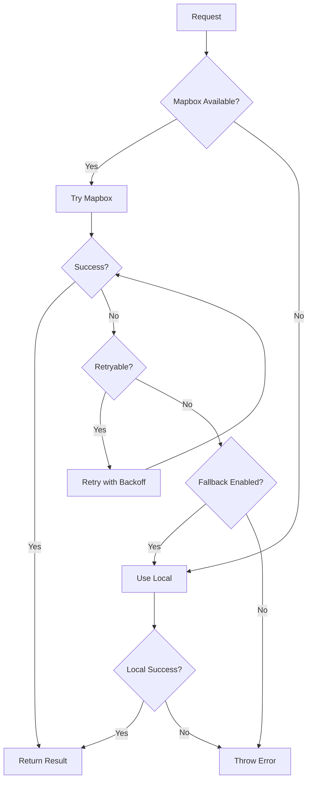

# Hybrid Routing System Integration

This document outlines the comprehensive hybrid routing system that has been integrated into the Transpoco Track application, combining Mapbox Directions API with local road network fallback.

## 🎯 Overview

The hybrid routing system provides production-grade road mapping and vehicle positioning while maintaining reliability through intelligent fallback mechanisms.

### Key Features

- **Hybrid Architecture**: Mapbox API for accuracy + Local network for reliability
- **Intelligent Fallback**: Automatic failover when external services are unavailable
- **Road Snapping**: Snap GPS coordinates to actual road networks
- **Performance Optimized**: Built-in caching, rate limiting, and batch processing
- **Health Monitoring**: Real-time service health checks and automatic recovery
- **Configuration Management**: Easy setup with environment variables

## 📁 File Structure

```
src/
├── types/routing.ts                    # TypeScript interfaces and types
├── lib/routing/
│   ├── index.ts                       # Main exports and factory functions
│   ├── config.ts                      # Configuration constants
│   ├── hybrid-routing-service.ts      # Main hybrid service
│   ├── mapbox-routing-service.ts      # Mapbox API integration
│   ├── local-routing-service.ts       # Local network wrapper
│   └── rate-limiter.ts               # Performance optimization
├── components/routing/
│   ├── RoutingStatus.tsx             # Service health monitoring
│   └── RoutingConfigGuide.tsx        # Setup configuration guide
├── stores/fleet.ts                    # Enhanced with routing methods
└── app/routing/page.tsx               # Demo and testing page
```

## 🚀 Quick Start

### 1. Environment Setup

Create a `.env.local` file in your project root:

```env
# Primary routing provider (recommended)
NEXT_PUBLIC_MAPBOX_ACCESS_TOKEN=pk.eyJ1IjoieW91ci11c2VybmFtZSIsImEiOiJjbGV4YW1wbGUifQ.example

# Base map rendering (required)
NEXT_PUBLIC_MAPTILER_API_KEY=your_maptiler_api_key

# Optional configuration
NEXT_PUBLIC_ROUTING_PROVIDER=hybrid
NEXT_PUBLIC_ENABLE_ROAD_SNAPPING=true
```

### 2. Basic Usage

```typescript
import { getRoutingService } from '@/lib/routing';

// Get the default hybrid routing service
const routingService = getRoutingService();

// Snap a GPS coordinate to the nearest road
const snapResult = await routingService.snapToRoad(53.3498, -6.2603);
console.log('Snapped to:', snapResult.location);

// Calculate route between two points
const route = await routingService.calculateRoute(
  [-6.2603, 53.3498], // Dublin city center
  [-6.2503, 53.3598] // North Dublin
);
console.log('Route distance:', route.distance, 'meters');
```

### 3. Fleet Integration

The fleet store now includes routing-enhanced methods:

```typescript
import { useFleetStore } from '@/stores/fleet';

const {
  snapVehicleToRoad,
  updateVehicleWithRoadSnapping,
  enableRouting,
  getRoutingServiceHealth,
} = useFleetStore();

// Enable road snapping for all vehicles
enableRouting(true);

// Snap a specific vehicle to road
await snapVehicleToRoad('vehicle-123');

// Update vehicle with automatic road snapping
await updateVehicleWithRoadSnapping(
  'vehicle-123',
  53.3498, // latitude
  -6.2603, // longitude
  90 // heading (optional)
);
```

## 🔧 Configuration Options

### Service Providers

| Provider | Description                               | Use Case                                    |
| -------- | ----------------------------------------- | ------------------------------------------- |
| `hybrid` | Intelligent combination of Mapbox + Local | **Recommended** - Best of both worlds       |
| `mapbox` | Mapbox API only                           | Production with guaranteed API availability |
| `local`  | Local network only                        | Development, offline, or cost-sensitive     |

### Routing Options

```typescript
interface RoutingOptions {
  profile?: 'driving' | 'driving-traffic' | 'walking' | 'cycling';
  radiusMeters?: number; // For road snapping (default: 50m)
  alternatives?: boolean; // Return alternative routes
  steps?: boolean; // Include turn-by-turn directions
}
```

## 📊 Performance Features

### Caching Strategy

- **Road Snapping**: 2-minute cache (GPS positions are relatively stable)
- **Route Calculation**: 5-minute cache (accounts for traffic changes)
- **Map Matching**: 1-minute cache (for GPS trace cleaning)
- **Traffic Info**: 30-second cache (real-time data)

### Rate Limiting

- **Mapbox**: 600 requests/minute (API limit compliance)
- **Automatic Queuing**: Requests are queued when limits are reached
- **Exponential Backoff**: Intelligent retry with increasing delays

### Error Handling

```typescript
try {
  const result = await routingService.snapToRoad(lat, lng);
} catch (error) {
  if (error.code === 'RATE_LIMIT') {
    // Handle rate limiting
  } else if (error.code === 'SERVICE_UNAVAILABLE') {
    // Service is down, using fallback
  }
}
```

## 🏗️ Architecture Details

### Service Selection Logic



### Health Monitoring

The system continuously monitors service health:

- **Periodic Health Checks**: Every 30 seconds
- **Automatic Recovery**: Services are re-enabled when health improves
- **Graceful Degradation**: Maintains functionality even with service failures

## 🎛️ Monitoring & Debugging

### Service Health Dashboard

Visit `/routing` in your application to access:

- Real-time service status
- Configuration validation
- Interactive testing tools
- Performance metrics

### Health Check API

```typescript
const health = useFleetStore().getRoutingServiceHealth();
console.log('Service health:', health);
// Output: { local: true, mapbox: true, hybrid: true }
```

### Debug Mode

Enable debug logging in development:

```typescript
// The system automatically logs routing decisions in development
console.log('mapbox routing success: snapToRoad');
console.warn('Mapbox health check failed: API key invalid');
```

## 📈 Benefits

### For Development

- **Zero Configuration**: Works out of the box with local road network
- **Easy Testing**: Built-in test tools and realistic demo data
- **Fast Iteration**: No API dependencies for basic functionality

### For Production

- **High Accuracy**: Mapbox provides real-world road geometry and traffic data
- **Reliability**: Local fallback ensures system never goes down
- **Cost Effective**: Intelligent caching and rate limiting reduce API costs
- **Scalable**: Handles thousands of vehicles with proper resource management

### For Fleet Operations

- **Accurate Positioning**: Vehicles snap to actual roads, not GPS noise
- **Realistic Movement**: Vehicle trails follow road networks naturally
- **Traffic Awareness**: Real-time traffic conditions affect routing
- **Better Analytics**: Clean, road-snapped data improves reporting

## 🔒 Best Practices

### API Key Management

```env
# ✅ Good: Use environment variables
NEXT_PUBLIC_MAPBOX_ACCESS_TOKEN=pk.your_token_here

# ❌ Bad: Never commit API keys to source control
const MAPBOX_TOKEN = 'pk.your_token_here';
```

### Error Handling

```typescript
// ✅ Good: Handle errors gracefully
try {
  const result = await routingService.snapToRoad(lat, lng);
  updateUI(result);
} catch (error) {
  console.warn('Road snapping failed, using raw coordinates:', error);
  updateUI({ location: [lng, lat], distance: 0 });
}

// ❌ Bad: Let errors break the application
const result = await routingService.snapToRoad(lat, lng); // Can throw
```

### Performance Optimization

```typescript
// ✅ Good: Batch operations when possible
const vehicles = await Promise.allSettled(
  vehicleIds.map((id) => snapVehicleToRoad(id))
);

// ❌ Bad: Sequential API calls
for (const id of vehicleIds) {
  await snapVehicleToRoad(id); // Slow and inefficient
}
```

## 📝 Migration Guide

### From Local-Only Routing

Replace direct calls to the old road network functions:

```typescript
// Before
import { snapToNearestRoad } from '@/lib/geo/roadNetwork';
const result = snapToNearestRoad(lat, lng);

// After
import { getRoutingService } from '@/lib/routing';
const routingService = getRoutingService();
const result = await routingService.snapToRoad(lat, lng);
```

### Updating Vehicle Position Updates

```typescript
// Before
updateVehicle(vehicleId, {
  currentPosition: { latitude, longitude, heading },
});

// After (with road snapping)
await updateVehicleWithRoadSnapping(vehicleId, latitude, longitude, heading);
```

## 🚨 Troubleshooting

### Common Issues

#### "No API Key" Warning

- **Cause**: Missing `NEXT_PUBLIC_MAPBOX_ACCESS_TOKEN`
- **Solution**: Add API key to `.env.local`, restart dev server
- **Impact**: System falls back to local routing (still functional)

#### Rate Limiting Errors

- **Cause**: Exceeding API rate limits
- **Solution**: The system handles this automatically with queuing
- **Prevention**: Enable caching, avoid unnecessary duplicate requests

#### Service Unavailable

- **Cause**: Network issues or API downtime
- **Solution**: System automatically falls back to local routing
- **Recovery**: Health checks will restore service when available

### Getting Help

- Check the routing status page at `/routing`
- Review browser console for detailed error messages
- Verify API keys are correctly configured
- Test with the built-in debugging tools

## 🔮 Future Enhancements

- **Multi-Provider Support**: Add Google Maps, HERE, and other routing providers
- **Advanced Caching**: Redis integration for distributed caching
- **Analytics Integration**: Route optimization based on historical data
- **Offline Support**: Pre-downloaded road networks for offline operation
- **Real-Time Traffic**: Enhanced traffic data integration
- **Route Optimization**: Multi-stop route planning for delivery optimization

---

The hybrid routing system provides a robust foundation for accurate, reliable fleet tracking while maintaining the flexibility to adapt to different operational requirements and constraints.
